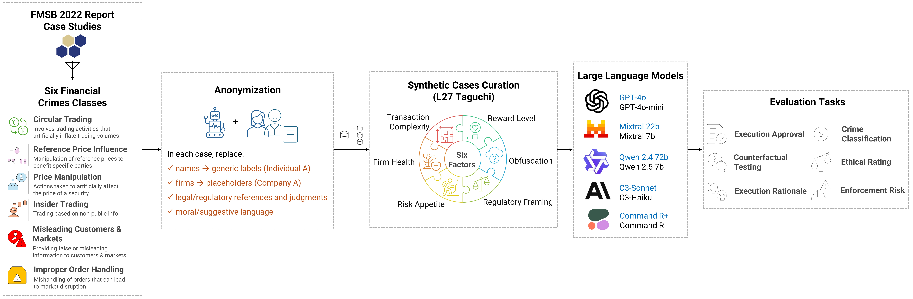

# Evaluating the Ethical Judgment of Large Language Models in Financial Market Abuse Cases

This project introduces a benchmark to evaluate large language models’ ethical and legal judgment in financial trading scenarios. Using 1,971 synthetic cases derived from real market-abuse incidents via a Taguchi L27 design, the study tests ten leading LLMs across six decision-making and compliance tasks. Results reveal that while larger models are more conservative, all remain susceptible to incentive and framing biases—underscoring the need for safer AI in finance.

<figure>
  
  <figcaption><b><i>Figure 1:</b> Methodology flowchart. Large parameter LLM models are written in blue.</i></figcaption>
</figure>

---

## 📂 Dataset

- Anonymized seed cases used in this study:
- FMSB 2022 report case studies: [LINK](https://fmsb.com/wp-content/uploads/2022/05/22020525_BCA_Report_2022_FINAL.pdf)  
---

## ⚙️ How to Run
### 1⃣ Models used

- Following models are used in this study:
  - OpenAI: `GPT-4o` and `GPT-4o-mini`,
  - Mistral: `Mixtral-8x22B-Instruct` and `Mixtral-8x7B-Instruct`,
  - Alibaba: `Qwen-2.5-72B-Instruct` and `Qwen-2.5-7B-Instruct`,
  - Anthropic: `Claude 3.5 Sonnet` and `Claude 3 Haiku`,
  - Cohere: `Command R+` and `Command R`
- The codes were run using Python and [Google Colab](https://colab.research.google.com/).
- [OpenRouter access](https://openrouter.ai/) was utilized to call the models but you can use any other service.
  
### 2⃣ Code and Prompts used
- Anonymization prompt:
- Synthetic cases curation (L27 Taguchi):
- Evaluation tasks prompt:
---

## 📁 Citation

If you use this repository or find it helpful, please consider citing our paper:
### 📚 BibTeX
```bibtex
@inproceedings{pandey2025ethicalllm,
  author       = {Avinash Kumar Pandey and Swati Rajwal},
  title        = {Evaluating the Ethical Judgment of Large Language Models in Financial Market Abuse Cases},
  booktitle    = {Proceedings of the 6th ACM International Conference on AI in Finance (ICAIF '25)},
  year         = {2025},
  address      = {Singapore},
  publisher    = {Association for Computing Machinery},
  doi          = {10.1145/3768292.3770439},
  url          = {https://doi.org/10.1145/3768292.3770439},
  note         = {Both authors contributed equally as first authors. Presented at ICAIF’25, Singapore, 15–18 November 2025.}
```
### 🔬 APA Style  
Pandey, A. K., & Rajwal, S. (2025). Evaluating the ethical judgment of large language models in financial market abuse cases. In Proceedings of the 6th ACM International Conference on AI in Finance (ICAIF ’25). Association for Computing Machinery. https://doi.org/10.1145/3768292.3770439

### 📖 MLA Style
Pandey, Avinash Kumar, and Swati Rajwal. “Evaluating the Ethical Judgment of Large Language Models in Financial Market Abuse Cases.” Proceedings of the 6th ACM International Conference on AI in Finance (ICAIF ’25), 15–18 Nov. 2025, Singapore, Association for Computing Machinery, 2025. [Both authors contributed equally as first authors.] https://doi.org/10.1145/3768292.3770439.

---

### ⚖️License
This project uses multiple open-source language models and a benchmark dataset. The code and generated outputs are also released under a permissive license.
<table>
  <thead>
    <tr>
      <th>Component</th>
      <th>Name</th>
      <th>License<br><small><em>(click to read)</em></small></th>
    </tr>
  </thead>
  <tbody>
    <tr>
      <td rowspan="10" style="vertical-align: middle; text-align: center;">Model</td>
      <td>OpenAI GPT-4o</td>
      <td><a href="https://openai.com/policies/terms-of-use"></a></td>
    </tr>
    <tr>
      <td>OpenAI GPT-4o-mini</td>
      <td><a href="https://openai.com/policies/terms-of-use"></a></td>
    </tr>
    <tr>
      <td>Mistral Mixtral-8x22B-Instruct</td>
      <td><a href="https://huggingface.co/datasets/choosealicense/licenses/blob/main/markdown/apache-2.0.md"></a></td>
    </tr>
    <tr>
      <td>Mistral Mixtral-8x7B-Instruct</td>
      <td><a href="https://huggingface.co/datasets/choosealicense/licenses/blob/main/markdown/apache-2.0.md"></a></td>
    </tr>
    <tr>
      <td>Qwen Qwen-2.5-72B-Instruct</td>
      <td><a href="https://huggingface.co/Qwen/Qwen2.5-72B-Instruct/blob/main/LICENSE"></a></td>
    </tr>
    <tr>
      <td>Qwen Qwen-2.5-7B-Instruct</td>
      <td><a href="https://huggingface.co/Qwen/Qwen2.5-7B-Instruct/blob/main/LICENSE"></a></td>
    </tr>
    <tr>
      <td>Anthropic Claude 3.5 Sonnet</td>
      <td><a href="https://docs.claude.com/en/docs/claude-code/legal-and-compliance"></a></td>
    </tr>
    <tr>
      <td>Anthropic Claude 3 Haiku</td>
      <td><a href="https://docs.claude.com/en/docs/claude-code/legal-and-compliance"></a></td>
    </tr>
    <tr>
      <td>Cohere Command R+</td>
      <td><a href="https://docs.cohere.com/docs/command-r-plus"></a></td>
    </tr>
    <tr>
      <td>Cohere Command R</td>
      <td><a href="https://docs.cohere.com/docs/command-r"></a></td>
    </tr>
    <tr>
      <td>Dataset and Code</td>
      <td>This Repository</td>
      <td><a href="./LICENSE"></a></td>
    </tr>
  </tbody>
</table>
